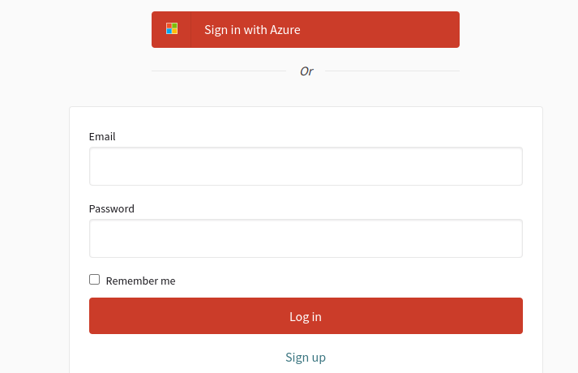
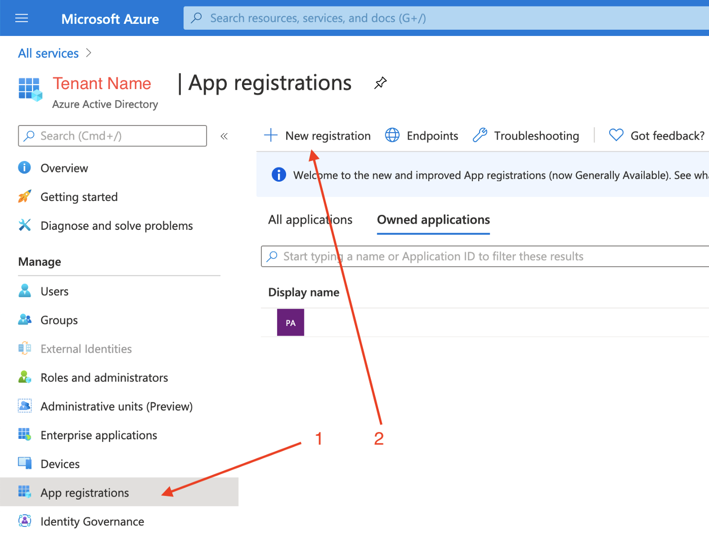
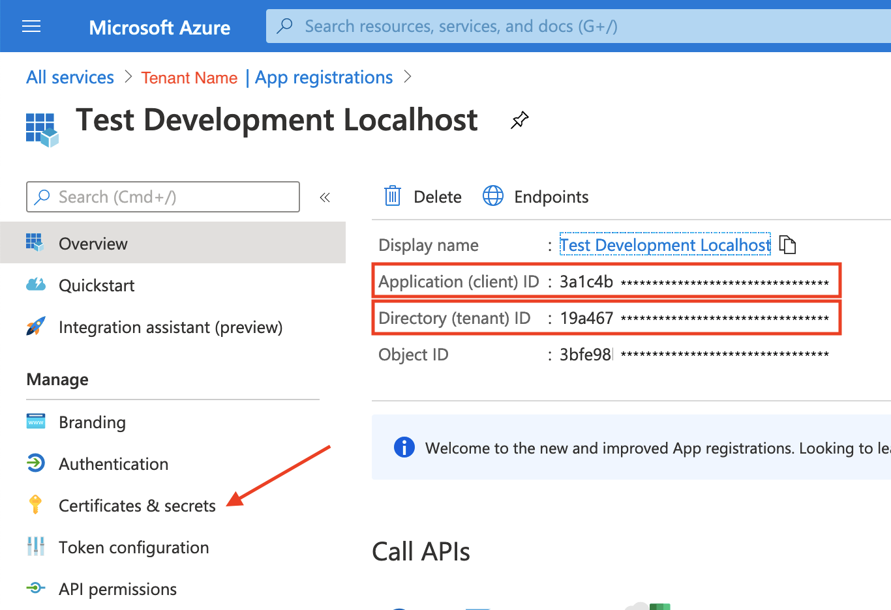

# OmniAuth::Decidim

[![[CI] Lint](https://github.com/openpoke/decidim-module-microsoft/actions/workflows/lint.yml/badge.svg)](https://github.com/openpoke/decidim-module-microsoft/actions/workflows/lint.yml)
[![[CI] Test](https://github.com/openpoke/decidim-module-microsoft/actions/workflows/test.yml/badge.svg)](https://github.com/openpoke/decidim-module-microsoft/actions/workflows/test.yml)
[](https://codeclimate.com/github/openpoke/decidim-module-microsoft/maintainability)
[](https://codecov.io/gh/openpoke/decidim-module-microsoft)
[](https://badge.fury.io/rb/decidim-microsoft)

This is the Microsoft/Azure ActiveDirectory (v2) strategy for login into Decidim using OmniAuth (SSO).



## Installation

Add this line to your application's Gemfile:

```ruby
gem 'decidim-microsoft'
```

And then execute:

```
bundle
```

## Usage

### Register a new App in your Azure account

Extracted from the initial instructions explained here:

https://medium.com/committed-engineers/setup-azure-ad-oauth-2-0-with-ruby-on-rails-and-devise-39848e3ed532

1. Go to your Azure account, [configure a new tenant](https://docs.microsoft.com/en-gb/azure/active-directory/fundamentals/active-directory-access-create-new-tenant) if you don't have any.

2. Register a new app n your tenant Azure Active Directory: 

3. Use `https://example.org/users/auth/azure_activedirectory_v2/callback` as the callback URI (change `example.org` for your own domain)

4. Generate a new client ID/Secret in "Certificates & secrets" 

5. Use the `Appliction (client) ID`, `Directory (tentant) ID` and the `Secret ID` to define the ENV variables.

6. Happy login!

### Configure the Decidim OAuth clients

By default, this strategy can be automatically configure using just these ENV vars:

```
AZURE_CLIENT_ID=XXXX
AZURE_TENANT_ID=XXXX
AZURE_CLIENT_SECRET=XXXX
```

By setting the ENV var `AZURE_CLIENT_ID` to value that's not empty, the "login with microsoft" button will appear automatically in you Decidim instance.

You can also customize the way you extract these secrets by creating a initializer file, such as:

```ruby
# config/initializers/microsoft_omniauth.rb

Decidim::Microsoft.configure do |config|
  config.omniauth = {
    enabled: Rails.application.secrets.dig(:omniauth, :microsoft, :enabled),
    client_id: Rails.application.secrets.dig(:omniauth, :microsoft, :client_id:),
    tenant_id: Rails.application.secrets.dig(:omniauth, :microsoft, :tenant_id),
    client_secret: Rails.application.secrets.dig(:omniauth, :microsoft, :client_secret),
    icon_path: Rails.application.secrets.dig(:omniauth, :microsoft, :icon_path), # be aware of webpacker, must by media/images/something
    # optional variables:
    # See https://github.com/RIPAGlobal/omniauth-azure-activedirectory-v2/blob/master/lib/omniauth/strategies/azure_activedirectory_v2.rb
    scope: Rails.application.secrets.dig(:omniauth, :microsoft, :scope),
    base_azure_url: Rails.application.secrets.dig(:omniauth, :microsoft, :base_azure_url),
    authorize_params: Rails.application.secrets.dig(:omniauth, :microsoft, :authorize_params),
    domain_hint: Rails.application.secrets.dig(:omniauth, :microsoft, :domain_hint)
  }
end
```

And, of course, having these values in your `config/secrets.yml` file.

## Contributing

Bug reports and pull requests are welcome on GitHub at https://github.com/openpoke/decidim-module-microsoft.

### Developing

To start contributing to this project, first:

- Install the basic dependencies (such as Ruby and PostgreSQL)
- Clone this repository

Decidim's main repository also provides a Docker configuration file if you
prefer to use Docker instead of installing the dependencies locally on your
machine.

You can create the development app by running the following commands after
cloning this project:

```bash
$ bundle
$ DATABASE_USERNAME=<username> DATABASE_PASSWORD=<password> bundle exec rake development_app
```

Note that the database user has to have rights to create and drop a database in
order to create the dummy test app database.

Then to test how the module works in Decidim, start the development server:

```bash
$ cd development_app
$ DATABASE_USERNAME=<username> DATABASE_PASSWORD=<password> bundle exec rails s
```

In case you are using [rbenv](https://github.com/rbenv/rbenv) and have the
[rbenv-vars](https://github.com/rbenv/rbenv-vars) plugin installed for it, you
can add the environment variables to the root directory of the project in a file
named `.rbenv-vars`. If these are defined for the environment, you can omit
defining these in the commands shown above.

#### Code Styling

Please follow the code styling defined by the different linters that ensure we
are all talking with the same language collaborating on the same project. This
project is set to follow the same rules that Decidim itself follows.

[Rubocop](https://rubocop.readthedocs.io/) linter is used for the Ruby language.

You can run the code styling checks by running the following commands from the
console:

```
$ bundle exec rubocop
```

To ease up following the style guide, you should install the plugin to your
favorite editor, such as:

- Atom - [linter-rubocop](https://atom.io/packages/linter-rubocop)
- Sublime Text - [Sublime RuboCop](https://github.com/pderichs/sublime_rubocop)
- Visual Studio Code - [Rubocop for Visual Studio Code](https://github.com/misogi/vscode-ruby-rubocop)

### Testing

To run the tests run the following in the gem development path:

```bash
$ bundle
$ DATABASE_USERNAME=<username> DATABASE_PASSWORD=<password> bundle exec rake test_app
$ DATABASE_USERNAME=<username> DATABASE_PASSWORD=<password> bundle exec rspec
```

Note that the database user has to have rights to create and drop a database in
order to create the dummy test app database.

In case you are using [rbenv](https://github.com/rbenv/rbenv) and have the
[rbenv-vars](https://github.com/rbenv/rbenv-vars) plugin installed for it, you
can add these environment variables to the root directory of the project in a
file named `.rbenv-vars`. In this case, you can omit defining these in the
commands shown above.

### Test code coverage

If you want to generate the code coverage report for the tests, you can use
the `SIMPLECOV=1` environment variable in the rspec command as follows:

```bash
$ SIMPLECOV=1 bundle exec rspec
```

This will generate a folder named `coverage` in the project root which contains
the code coverage report.

### Localization

If you would like to see this module in your own language, you can help with its
translation at Crowdin:

https://crowdin.com/project/decidim-module-microsoft

## License

See [LICENSE-AGPLv3.txt](LICENSE-AGPLv3.txt).
